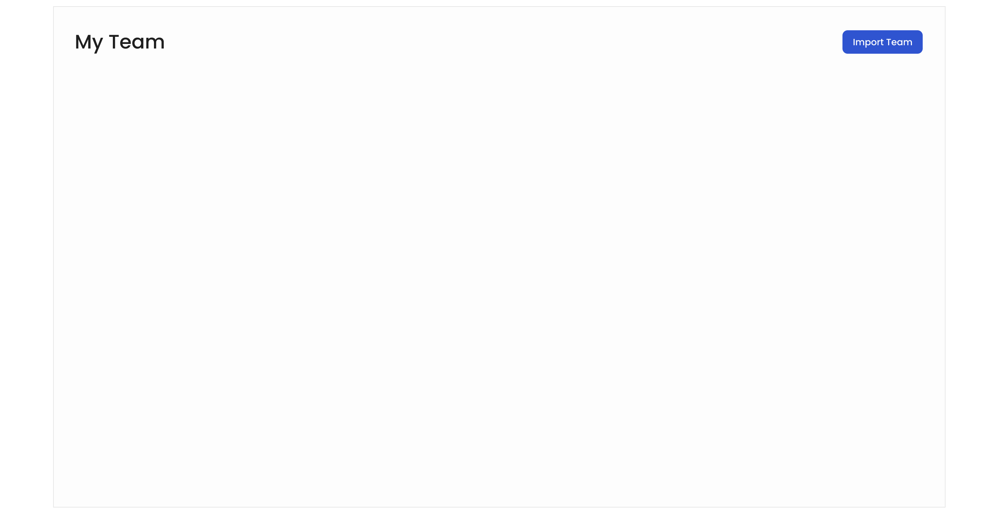
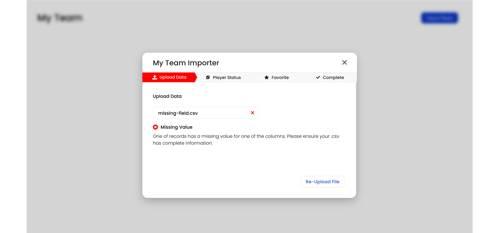
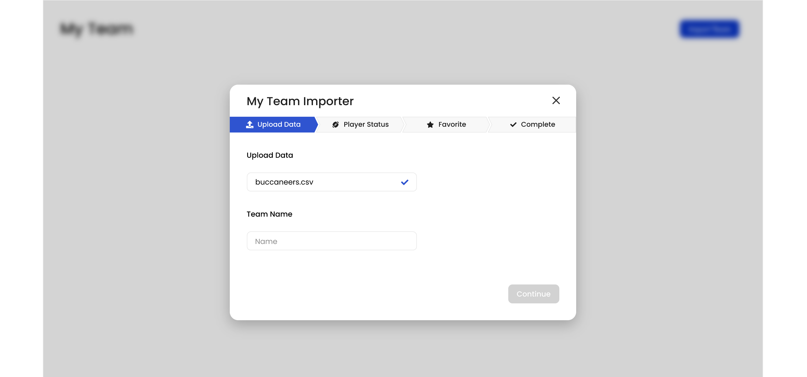
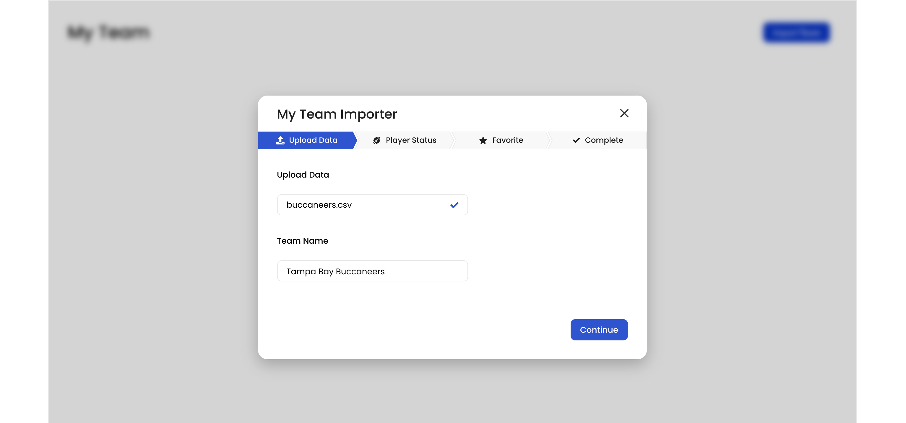
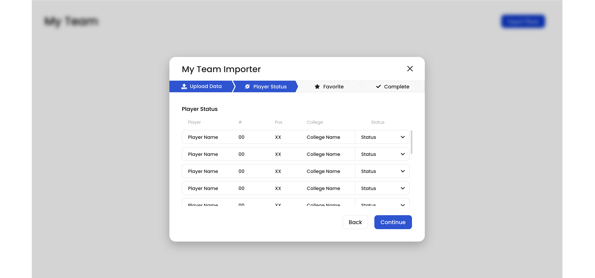
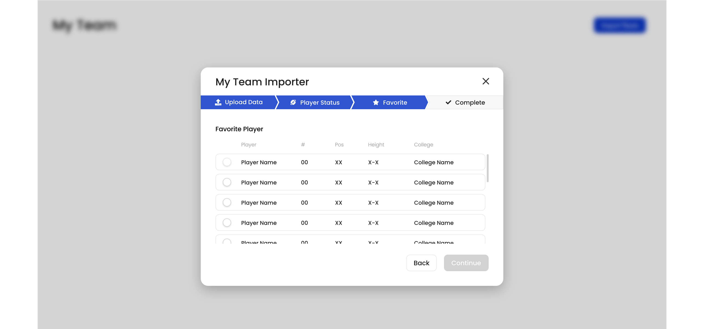
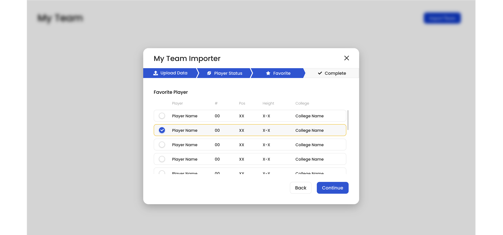
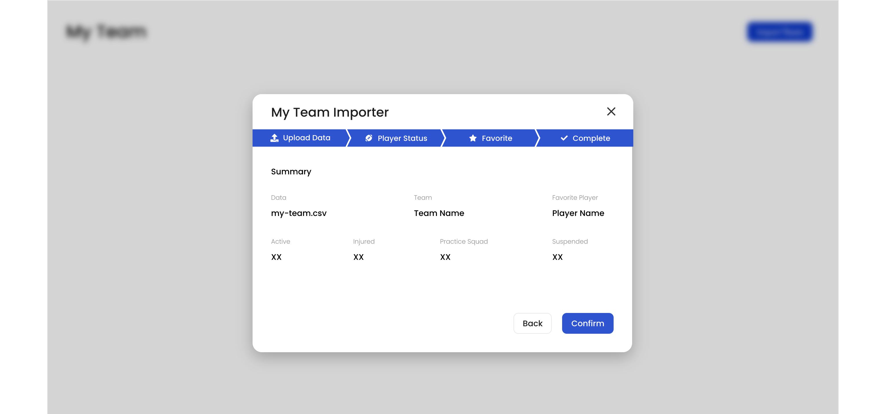
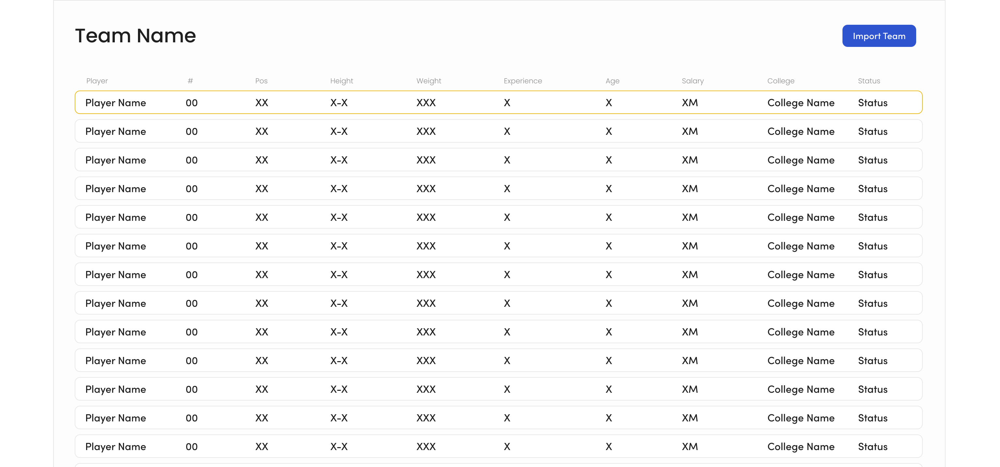

<h1 align="center">
    
    
    
    
    
    
    
    
    
    
    
    
</h1>

<h2 align="center">
   🏆 <a href="#">My Team Data</a>
</h2>

<h3 align="center">
    A list of all My Team Data
</h3>

---

<!-- TABLE OF CONTENTS -->
<details open="open">
  <summary>Table of Contents</summary>
  <ol>
    <li><a href="#about">About</a></li>
    <li><a href="#features">Features</a></li>
    <li><a href="#how-to-start-the-project">How to start the Project</a></li>
    <li><a href="#technologies">Technologies</a></li>
    <li><a href="#author">Author</a></li>
  </ol>
</details>

---


## About

🏆 My Team Data - is an application that reads a CSV file and let's you interact with the file.<br />

---

## Features

- Step 1 - Submit Data
  - The user should be able to submit the players.csv file and if everything is correct move on to the next step. If the user submits a file with incomplete data (missing field), the UI should show an error and prevent the user to continue.
- Step 2 - Change Category
  - Here the fields from the data should populate a table where the player status can be changed.
- Step 3 - Favorite Player
  - From that list, the user can flag a player as his favorite. At this point, the user can confirm and visualize the result.
- Step 4 - My Team
  - After submitting the file, the user should be able to see his full team on the main page.

[Resources](https://xd.adobe.com/view/66c0b6fc-e7fd-4edd-b7ae-072f5c9402a6-3393/) on Adobe XD.


## How to start the project

### - Pre-requisites:

Before you begin, you will need to have the following tools installed on your machine:
[Git] (https://git-scm.com), [Node.js] (https://nodejs.org/en/).
In addition, it is good to have an editor to work with the code like [VSCode] (https://code.visualstudio.com/)


### Running the web application (React)

```bash

# Clone this repository
$ git clone https://github.com/henriquealbert/koneksys-react.git

# Access the project folder in your terminal
$ cd koneksys-react

# Install the dependencies
$ npm install
# or with yarn
$ yarn install

# Run the application in development mode
$ npm run start
# or with yarn
$ yarn start

# The application will open on the port: 3000 - go to http://localhost:3000

```

---

## Technologies

The following tools were used in the construction of the project:

-   **[React.js](https://github.com/facebook/create-react-app)**
-   **[React Icons](https://react-icons.github.io/react-icons/)**
-   **[Papaparse](https://github.com/mholt/PapaParse)**

I've choose Papaparse to parse CSV files, beause it's the most popular csv parser on npm.

> See the file  [package.json](https://github.com/henriquealbert/koneksys-react/blob/master/package.json)


---

## Author

 
 <sub><b>Henrique Albert Schmaiske</b></sub>
 <br />

[](https://twitter.com/hschmaiske) [](https://www.linkedin.com/in/henrique-albert-schmaiske/)
[](mailto:ishenriquealbert@gmail.com)

---

## 📝 License

This project is under the license [MIT](./LICENSE).

Made with love by Henrique Albert Schmaiske 👋🏻 [Get in Touch!](https://www.linkedin.com/in/henrique-albert-schmaiske/)

